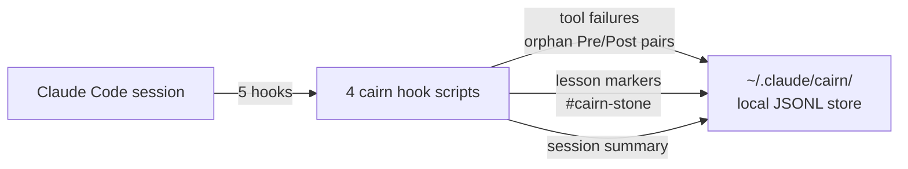

# Cairn

[](LICENSE)
[](https://gitforwindows.org)
[](https://github.com/ziyilam3999/cairn/releases)

Cairn is a lightweight capture layer for [Claude Code](https://claude.com/claude-code). It watches every tool call your session makes, writes failures and lesson markers (`#cairn-stone: ...`) to a local JSONL store, and builds up a per-session record you can grep, index, or feed back to the model.

It is implemented as four small bash scripts wired into Claude Code's hook system. There is no daemon, no network call, no telemetry. Everything stays on disk under `~/.claude/cairn/`.



## Prerequisites

- [Claude Code](https://claude.com/claude-code) CLI installed and working
- `python3` on `PATH`
- `bash`

**v0.1.0 supports Git Bash on Windows only** (MINGW64 / MSYS). macOS, Linux, WSL2, and Cygwin are **not supported** in this release — the installer will exit with a clear error on those platforms. Cross-platform support is planned.

**Windows multi-drive note:** clone `cairn` onto the same drive as your user profile (typically `C:\`). Cairn installs hooks via NTFS hardlinks, and hardlinks cannot cross volumes — the installer will refuse to continue if the clone and `$HOME` are on different drives.

## Install

```bash
git clone https://github.com/ziyilam3999/cairn.git
bash cairn/scripts/install.sh
```

Re-run anytime — the installer is idempotent.

## What gets installed

- 4 hook scripts hardlinked into `~/.claude/hooks/`:
  - `cairn-session-start.sh`
  - `cairn-tool-use.sh`
  - `cairn-stop.sh`
  - `cairn-session-end.sh`
- 5 hook entries merged into `~/.claude/settings.json`:
  - `SessionStart` → `cairn-session-start.sh`
  - `PreToolUse` → `cairn-tool-use.sh` (matcher `.*`)
  - `PostToolUse` → `cairn-tool-use.sh` (matcher `.*`)
  - `Stop` → `cairn-stop.sh`
  - `SessionEnd` → `cairn-session-end.sh`
- Directories created under `~/.claude/cairn/`: `t1-run-scratch/`, `t1-pending/`, `sessions/`
- A capability probe written to `~/.claude/cairn/install-probe.json`

The single shared script `cairn-tool-use.sh` is registered on **both** `PreToolUse` and `PostToolUse` and branches internally on `hook_event_name`.

## How it works

- **Pre/Post pairing.** On every `PreToolUse`, Cairn writes a tiny pending file keyed by `tool_use_id`. On the matching `PostToolUse` (which only fires for **successful** calls), Cairn deletes it. At the end of every assistant turn, the `Stop` hook scans for orphan pending files (Pre with no Post = guaranteed failure) and writes them to the JSONL store as `tool-failure` records.
- **Lesson markers.** The `Stop` hook also scans your last assistant message for the literal token `#cairn-stone:` followed by up to 500 characters. Any match becomes a `lesson` record.
- **Session summary.** The `SessionEnd` hook re-runs the orphan sweep and appends one deterministic `summary` line per session: `Session {id} · duration {s}s · {N} tool failures captured · {M} lessons marked`.

Full spec: [`docs/capture-hooks.md`](docs/capture-hooks.md).

## Data layout

```
~/.claude/cairn/
├── t1-run-scratch/
│   └── 2026-04-14/
│       └── {session-id}.jsonl     # one JSON record per line
├── t1-pending/
│   └── {session-id}/
│       └── {tool-use-id}.json     # transient; deleted on PostToolUse
├── sessions/
│   └── {session-id}.start         # UTC epoch seconds at session start
├── last-session-id
├── last-session-date
└── install-probe.json
```

Example JSONL line:

```json
{"ts":"2026-04-14T09:12:33Z","session_id":"abc123","project":"/c/Users/me/repo","kind":"tool-failure","payload":{"tool":"Bash","cmd_snippet":"bash -c 'exit 1'","reason":"orphaned_pre_without_post"}}
```

## Privacy

- All data is written **locally** to `~/.claude/cairn/`. Nothing is transmitted.
- Cairn hooks fire on every Claude Code session globally because `~/.claude/settings.json` is global. Captured records — including `last_assistant_message` content from any project — are partitioned by `session_id` and `cwd` in the JSONL payload, so downstream readers can filter by project.
- The lesson-marker scan is intentionally cross-project: any `#cairn-stone:` in any session enters the same store.

## Manual uninstall

There is no automated uninstall in v0.1.0.

```bash
# 1. Remove the hardlinks
rm -f ~/.claude/hooks/cairn-session-start.sh \
      ~/.claude/hooks/cairn-tool-use.sh \
      ~/.claude/hooks/cairn-stop.sh \
      ~/.claude/hooks/cairn-session-end.sh

# 2. Remove the cairn entries from ~/.claude/settings.json by hand
#    (look for "command": "bash ~/.claude/hooks/cairn-...")

# 3. Optionally drop the data directory
rm -rf ~/.claude/cairn/
```

## Known limitations (v0.1.0)

- Windows Git Bash only; no macOS / Linux / WSL2 / Cygwin support
- No CI / lint
- No automated uninstall script
- No cross-volume NTFS hardlink support — clone and `$HOME` must be on the same drive
- No AI-generated session summaries (template only)
- `canon()` settings.json deduper does not normalize `${HOME}` curly-brace form

## License

[MIT](LICENSE)
